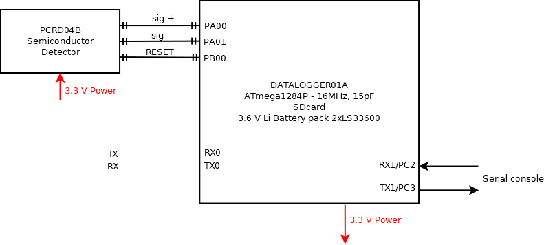

# AIRDOSF01A - Airborne cosmic radiation dosimeter without GPS 

Cosmic radiation dosimeter unit. It is intended for airborne measurement of cosmic radiation and dosimetry in mixed ionization fields on board of aircraft. 
"F" version of AIRDOS has a flipped PIN diode sensor (by 90 degrees) in comparison of newer [AIRDOS02](https://github.com/UniversalScientificTechnologies/AIRDOS02) alternative.

Technical parameters are following: 

* Silicon PIN diode detector with 60mm3 detection volume
* Measurement endurance 180 days
* Number of erengy channels    248
* Energy measurement resolution    <60 keV/channel
* Integration time    10 s
* Size LxWxH 166 mm x 107 mm x 57 mm 
* Weight 0.8 kg (without batteries)

Device block diagram

PCRD04B semiconductor detector schematics

The device was replaced by [AIRDOS02](https://github.com/UniversalScientificTechnologies/AIRDOS02). The content and design in this repository is protected by [GNU General Public License v3.0](LICENSE).
